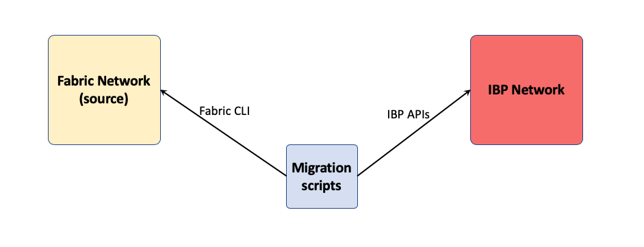
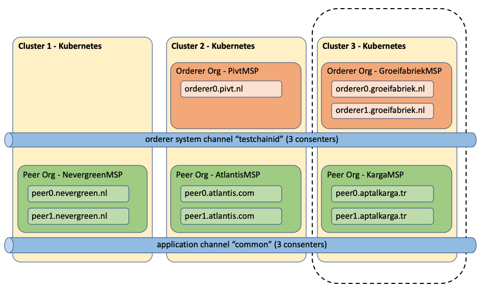
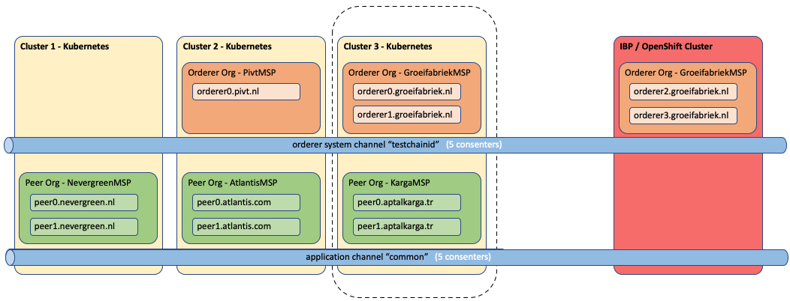
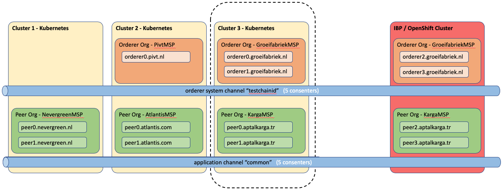
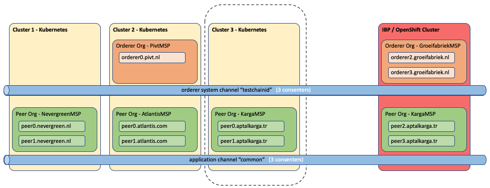
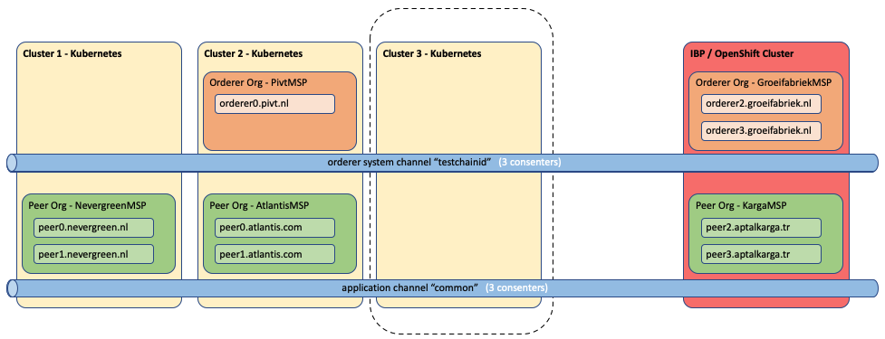

# Migrating Orderer and Organizations MSPs

## Introduction

The term Organization is used here from a generic business point of view. An Organization will have a Peer Org MSP, a Peer Org MSP Admin identity and one or more peers and potentially can also have an Orderer Org MSP plus an Orderer Org MSP Admin identity that will provide one or more consenter nodes to a network wide Raft based Orderer. 

For each Organization or node in the network, we will extend the Orderer and Peer MSPs and create new orderer and peers kubernetes pods on the target network. ``A key concept here is that within the context of a network migration, we don't need to create new Org MSPs but we will reuse the existing ones.`` The migration process described in this section must be repeated for **each business Organization in the network**. Also, note that we will not remove the already migrated consenters and peers until the very end. This is to allow to roll back and return to the original source network in case of major problems. 

## Prerequisites 

The prerequisites are: 
1. There is a HL Fabric network (`source network`) that has a Raft based Orderer. The source network will be migrated to an IBP based network (`target network`) that supports the same HL Fabric version of the source network.
2. Every Orderer node in the source network must be network accessible from the target network. 
3. There is a Kubernetes or OpenShift cluster for the target network with IBP already installed.
4. Fabric CLI commands are installed for the Fabric version we want to migrate. 

## The Big Picture

The next diagram show a high level view of the migration process: we have the migration scripts in the middle that will talk to the source network on the left using Fabric CLI commands and to the IBP network on the right using IBP APIs. 

 


## The Source Network

To better describe the migration process we will use a real HL Fabric sample network based on this open source repo https://github.com/APGGroeiFabriek/PIVT 



In this source network, we have three independent business Organizations each running on a separate kubernetes cluster. Each Organization has a Peer Organization with two peers each. Two of the three Organizations provide consenter nodes for the Raft orderer. There is an `orderer system channel` called `testchainid` and an `application channel` called `common` where all peers are connected. We will describe the process of migrating the Business Organization running on Cluster 3 (`source org`).

One characteristic of this source network, is that all certificates come from an external CA, therefore there are no FabricCA nodes deployed. In this particular migration example, we will create the certificates for the new orderer and peer nodes using the openssl command but leveraging the same Root CA/PK and Root TLSCA/PK from the source network. The creation of these certificates is done under the `createCerts` folder. Note that in a real production migration scenario these new certificates should be provided by the customer's certification authority. 

Source Network MSP Org List:

* GroeifabriekMSP (Orderer Org)
* PivtMSP         (Orderer Org)
* KargaMSP        (Peer Org)
* AtlantisMSP     (Peer Org)
* NevergreenMSP   (Peer Org)


## Procure Crypto Material from Source Network

Under the `crypto-config` folder, provide the crypto material for:

1. The source Org Orderer MSP admin identity (GroeifabriekMSP-Admin) and one or more Orderer MSP admins (PivtMSP-Admin) that will be required to sign the channel update transaction. In our Fabric source network, the channel update policy requires a majority of the orderer organizations to sign the configuration update. Since there are two orderer organizations and the majority of two is two, we need both organizations to sign. 
2. The Peer Org MSP admin identity (Admin@aptalkarga.tr) that will be used to create the new peers in the target network.


The crypto material under the crypto-config folder is used in two different ways. Its used by the Fabric CLI commands as context parameters and in this particular example its also used by the openssl based scripts under the createCerts folder to generate the crypto material for the new orderers and peer nodes in IBP.

You will also have to provide crypto material in two more places: 
1. The orderer node config file that has all the information required to create a new orderer node (ordererMigrationConfig.json)
2. The peer node config file that has all the information required to create a new peer node (peerMigrationConfig.json)


## Orderer Consenter Migration

### Create IBP APIs Config Files

The script createConfigOrderer.sh creates three .json files under the IBPconfig folder:  the Orderer Node config, the Orderer Org. MSP config and the Orderer Org. Admin identity for the IBP wallet. The script requires a configuration file ordererMigrationConfig.json that has the crypto material plus other parameters.  Complete the ordererMigrationConfig.json file and run this script: 

```
./createConfigOrderer.sh ordererMigrationConfig.json
```

### Create Orderer Org MSP in IBP

Complete the parameters required in createOrderer-IBP.json and run this script to create the Orderer MSP in IBP. This command must be run only one time since the same Orderer MSP applies for all orderer consenter nodes in IBP.

```
./createOrdererMSP-IBP.sh createOrderer-IBP.json
```

### Create Orderer Node in IBP (First Step)

Creating the orderer node is a two step process:

In the **first step**, the orderer will be "pre-created" and start without a genesis block. It is effectively dead until it is configured. This is the first step to append a node to a raft cluster. 

Between the first and the second steps, we will add this node as a consenter to the system-channel by running a channel config update transaction. 

In the **second step**, we will bootstrap this node by sending the updated system-channel config-block leveraging the IBP AP called "Submit config block to orderer". Note that the node will not be usable until all these steps are completed. Finally, we will add this new consenter node to application channels as needed. 

Reuse the same createOrderer-IBP.json and run this script to complete the `first step`.

```
./createOrdererNodeStep1-IBP.sh createOrderer-IBP.json
```

### Confirm Orderer Network Connectivity

The new orderer node just created must be able to connect to the other orderer nodes in the source network. One way to do this is by defining hostAliases in the deployment yaml file of the new orderer node. Note that although this is possible in IBP v2.1.3, future IBP versions may disallow this practice.

This is a sample hostAliases definition:

```
  hostAliases:
  - ip: "169.48.122.237"
    hostnames:
    - "orderer0.groeifabriek.nl"
  - ip: "169.48.122.234"
    hostnames:
    - "orderer1.groeifabriek.nl"
  - ip: "169.61.22.21"
    hostnames:
    - "orderer0.pivt.nl" 
```


### Add Consenter to the System Channel

Now we are between the first and the second steps, update the channel configuration as described in the main README. 
In this particular example, since we are adding a new consenter in IBP we will need to provide the new consenter TLS and URL information. Note that you need to add or remove consenter nodes `one by one` as we always need to have (Raft) quorum to accept the update. 


### Submit Config Block to Orderer Node (Second Step)


Now we are ready for the `second step`. We will send a config block (or genesis block) to the pre-created raft orderer node. The script will use IBP APIs to finish the Raft-append flow and finalize the pre-created orderer. This is the final step to append a node to our Raft cluster. The orderer node will restart, load this block, and connect to the other orderers listed in said block.

Return to the `migrateOrganizations` folder and run this script:

```
./createOrdererNodeStep2-IBP.sh  createOrderer-IBP.json
```

Login to the IBP console and verify that the just added orderer node shows the green status. Also, using the Kubernetes or OpenShift console look at the new orderer node logs to verify that blocks are synced. 


### Add Consenter to the Application Channel

At this time we have the new consenter node added to the system channel. The process to add the same consenter to the application channel is very similar to the previous section `Add Consenter to the System Channel`. Make sure you reference the application channel this time. In our `source network` the application channel is called `common`. Note that in a real migration scenario there may be multiple application channels that the consenter must be added.


### Migrate Second Consenter Node

Repeat the steps in this section to migrate every consenter node that belongs to this Orderer Org MSP. 

The following image describes the current state of the network migration process: we have extended the Orderer Org GroeifabriekMSP to IBP and we have created two additional consenters that were added to both, the system channel and the application channel.




## Peer Node Migration


### Create IBP APIs Config Files

The script createConfigPeer.sh creates three .json files under the IBPconfig folder:  the Peer Node config, the Peer Org. MSP config and the Peer Org. Admin identity for the IBP wallet. The script requires a configuration file peerMigrationConfig.json that has the crypto material plus other parameters.  Complete the peerMigrationConfig.json file and run this script: 

```
./createConfigPeer.sh peerMigrationConfig.json
```

### Create Peer Org MSP in IBP

Complete the parameters required in createPeer-IBP.json and run this script to create the Peer Org MSP in IBP. This command must be run only one time since the same Peer Org MSP applies for all peers.

```
./createPeerMSP-IBP.sh createPeer-IBP.json
```

### Create Peer Node in IBP

Reuse the same createPeer-IBP.json file and run this script to create the Peer Pod in IBP.

```
./createPeerNode-IBP.sh createPeer-IBP.json
```

### Confirm Peer Network Connectivity

The new Peer Pod just created must be able to connect to the other orderer nodes in the source network. One way to do this is by defining hostAliases in the deployment yaml file of the new Peer Pod. Note that although this is possible in IBP v2.1.3, future IBP versions may disallow this practice.

This is a sample hostAliases definition that applies to this example:

```
  hostAliases:
  - ip: "169.48.122.237"
    hostnames:
    - "orderer0.groeifabriek.nl"
  - ip: "169.48.122.234"
    hostnames:
    - "orderer1.groeifabriek.nl"
  - ip: "169.61.22.21"
    hostnames:
    - "orderer0.pivt.nl" 
```

### Add Peer to Application Channel

From the IBP Console join the new peer to the channel. Using the Kubernetes or OpenShift console look at the new peer node logs to verify that blocks are synced. 


### Migrate Other Peer Nodes

Repeat the steps in this section to migrate every peer node that belongs to this Peer Org MSP. 

The following image describes the current state of the network migration process: we have extended the Peer Org KargaMSP to IBP and we have created two additional peers that were joined to the application channel "common".





## Remove Source Network Consenters

Now that we have all the the business organization' consenters replicated in IBP, we can remove them from the source network. As we have mentioned before, the removal of consenters must be done one-by-one in order to maintain (Raft) quorum. Always, first remove the consenter from every application channel that the consenter is participating before removing it from the system channel.

In a real production migration scenario, you may want to wait until ALL business organizations have been successfully migrated before you start removing consenters and peers from the source network. 


### Remove Consenter from Application Channel

Repeat the steps described previously under the section "Add Consenter to the Application Channel" with the caveat that instead of adding the consenter, we will remove the consenter from the channel configuration json file. 


### Remove Consenter from System Channel

Repeat the steps described previously under the section "Add Consenter to the System Channel" with the caveat that instead of adding the consenter, we will remove the consenter from the channel configuration json file. 


The following image describes the current state of the network migration process: we have removed both consenters in the source network from both channels.





## Remove Source Network Peers

We have to **remove the source network anchor peers** from the application channel configuration. This is a channel configuration update transaction on the application channel. 
We also have to make sure that the source network peer identities are not used to submit any future transaction on the application channel. In other words, we have to **add the peer identities to the certificate revocation list** of the application channel. This is also a channel configuration update transaction on the application channel. 


## Organization Migrated !! 

The following image describes the final state of the organization migration process.




